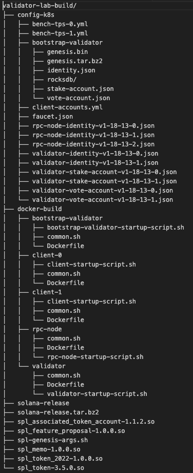

# Validator Lab
### Deploy Validator Clusters for Testing

#### About
In Validator Lab we can deploy and test new validator features quickly and easily. Validator Lab will take your modified validator code and deploy a cluster of validators running in Kubernetes pods on nodes all around the world. This allows us to spin up and tear down over a thousand validators with ease and with little user intervention.

### Disclaimer:
- This library is a work in progress. It will be built over a series of PRs. See [PROGRESS.md](PROGRESS.md) for roadmap and progress

## How to run

### Setup
Ensure you have the proper permissions to connect to the Monogon Kubernetes endpoint. Reach out to Leo on slack if you need the key (you do if you haven't asked him in the past).

From your local build host, login to Docker for pushing/pulling repos. Currently we just use the users own Docker login. This will likely change in the future.
```
docker login
```

```
kubectl create ns <namespace>
```

### Run
#### Build Agave from local agave repo
```
cargo run --bin cluster --
    -n <namespace>
    --local-path <path-to-local-agave-monorepo>
    --cluster-data-path <path-to-directory-to-store-cluster-accounts-genesis-etc>
```

#### Build specific Agave release
```
cargo run --bin cluster --
    -n <namespace>
    --release-channel <agave-version: e.g. v1.17.28> # note: MUST include the "v"
    --cluster-data-path <path-to-directory-to-store-cluster-accounts-genesis-etc>
```

#### Build specific Agave commit
```
cargo run --bin cluster --
    -n <namespace>
    --commit <git commit: e.g. 8db8e60c48ab064c88a76013597f99c9eb25ed74> # must be full string
    --github-username <github username: e.g. gregcusack>
    --repo-name <repository to build: e.g. solana | agave. default: solana>
    --cluster-data-path <path-to-directory-to-store-cluster-accounts-genesis-etc>
```

#### Note on `--cluster-data-path`:
`--cluster-data-path` can just be an empty directory. It will be used to store:
1) Validator, client, rpc, and faucet account(s)
2) Genesis
3) Validator, client, and rpc Dockerfiles

After deploying a cluster with a bootstrap, 2 clients, 2 validators, and 3 rpc nodes all running v1.18.13, your `<cluster-data-path>` directory will look something like:



#### Build from Local Repo and Configure Genesis and Bootstrap and Validator Image
Example:
```
cargo run --bin cluster -- 
    -n <namespace> 
    --local-path /home/sol/solana
    --cluster-data-path /home/sol/validator-lab-build
    --num_validators <number-of-non-bootstrap-voting-validators>
    # genesis config. Optional: Many of these have defaults
    --hashes-per-tick <hashes-per-tick>
    --faucet-lamports <faucet-lamports>
    --bootstrap-validator-sol <validator-sol>
    --bootstrap-validator-stake-sol <validator-stake>
    --max-genesis-archive-unpacked-size <size in bytes>
    --target-lamports-per-signature <lamports-per-signature>
    --slots-per-epoch <slots-per-epoch>
    # docker config
    --registry <docker-registry>        # e.g. gregcusack 
    --base-image <base-image>           # e.g. ubuntu:20.04
    --image-name <docker-image-name>    # e.g. cluster-image
    # validator config
    --full-rpc
    --internal-node-sol <Sol>
    --internal-node-stake-sol <Sol>
    # kubernetes config
    --cpu-requests <cores>
    --memory-requests <memory>
    # deploy with clients
    -c <num-clients>
    --client-type <client-type e.g. tpu-client>
    --client-to-run <type-of-client e.g. bench-tps>
    --client-wait-for-n-nodes <wait-for-N-nodes-to-converge-before-starting-client>
    --bench-tps-args <bench-tps-args e.g. tx-count=25000>
```

#### Client bench-tps-args
Client accounts are funded on deployment of the client.

Command Examples:
For client version < 2.0.0 && client version > 1.17.0
```
--bench-tps-args 'tx-count=5000 keypair-multiplier=4 threads=16 num-lamports-per-account=200000000 sustained tpu-connection-pool-size=8 thread-batch-sleep-ms=0'
```

For client Version >= 2.0.0
```
--bench-tps-args 'tx-count=5000 keypair-multiplier=4 threads=16 num-lamports-per-account=200000000 sustained tpu-connection-pool-size=8 thread-batch-sleep-ms=0 commitment-config=processed'
```

## Metrics
1) Setup metrics database:
```
./init-metrics -c <database-name> -u <metrics-username>
# enter password when prompted
```
2) add the following to your `cluster` command from above
```
--metrics-host https://internal-metrics.solana.com # need the `https://` here
--metrics-port 8086
--metrics-db <database-name>            # from (1)
--metrics-username <metrics-username>   # from (1)
--metrics-password <metrics-password>   # from (1)
```

#### RPC Nodes
You can add in RPC nodes. These sit behind a load balancer. Load balancer distributed loads across all RPC nodes and the bootstrap. Set the number of RPC nodes with:
```
--num-rpc-nodes <num-nodes>
```

## Heterogeneous Clusters
You can deploy a cluster with heterogeneous validator versions
For example, say you want to deploy a cluster with the following nodes:
* 1 bootstrap, 3 validators, 1 rpc-node, and 1 client running some agave-repo local commit
* 5 validators and 4 rpc nodes running v1.18.15
* 20 clients running v1.18.14

Each set of validators and clients get deployed individually by version. But they will all run in the same cluster

1) Deploy a local cluster as normal:
   * Specify how many validators, rpc nodes, and clients you want running v1.18.14
```
cargo run --bin cluster -- -n <namespace> --registry <registry> --local-path /home/sol/solana --num-validators 3 --num-rpc-nodes 1 --cluster-data-path /home/sol/validator-lab-build/ --num-clients 1 --client-type tpu-client --client-to-run bench-tps --bench-tps-args 'tx-count=5000 threads=4 thread-batch-sleep-ms=0'
```
2) Deploy a set of 5 validators running a different validator version (e.g. v1.18.15)
    * Must pass in `--no-bootstrap` so we don't recreate the genesis and deploy another bootstrap
```
cargo run --bin cluster -- -n <namespace> --registry <registry> --release-channel v1.18.15 --num-validators 5 --num-rpc-nodes 4 --cluster-data-path /home/sol/validator-lab-build/ --no-bootstrap
```
3) Deploy the final set of clients running v1.18.14 these 20 clients will load the cluster you deployed in (1) and (2)
    * Must pass in `--no-bootstrap` so we don't recreate the genesis and deploy another bootstrap
```
cargo run --bin cluster -- -n <namespace> --registry <registry> --release-channel v1.18.14 --cluster-data-path /home/sol/validator-lab-build/ --num-clients 20 --client-type tpu-client --client-to-run bench-tps --bench-tps-args 'tx-count=10000 threads=16 thread-batch-sleep-ms=0' --no-bootstrap
```

For steps (2) and (3), when using `--no-bootstrap`, we assume that the directory at `--cluster-data-path <directory>` has the correct genesis, bootstrap identity, and faucet account stored. These are all created in step (1).

Note: We can't deploy heterogeneous clusters across v1.17 and v1.18 due to feature differences. Hope to fix this in the future. Have something where we can specifically define which features to enable.

## Querying the RPC from outside the cluster
The cluster now has an external IP/port that can be queried to reach the cluster RPC. The external RPC port will be logged during cluster boot, e.g.:
```
Deploying Load Balancer Service with external port: 30000
```
1) Get any one of the node IPs in the cluster. Querying the RPC will work with any node IP in the cluster, this includes nodes that are NOT running any of your pods:
```
kubectl get nodes -o wide
```
2) Run your query. e.g.
```
curl -X POST \
-H "Content-Type: application/json" \
-d '{
    "jsonrpc": "2.0",
    "id": 1,
    "method": "getClusterNodes"
    }' \
http://<node-ip>:<external-port>
```

## Generic Clients
Bring your own client and deploy it in a Validator Lab cluster!
All you need is a containerized version of your client in an accessible docker registry. 

Key points/steps:
1) [Containerize your client](#Containerize-your-Client)
2) Any client accounts should be built into the client container image
3) Client arguments are passed in similar to how they are passed into the bench-tps client. For the generic client, use `--generic-client-args`. 

For example, let's assume we have a client sending spam. And it takes the following arguments:
```
/home/solana/spammer-executable --target-node <ip:port> --thread-sleep-ms <ms-between-spam-batches> --spam-mode <client-specific-mode>
```
When we go to deploy the generic client, we deploy it in a similar manner to how we deploy the bench-tps client:
```
cargo run --bin cluster -- -n <namespace>
...
generic-client --docker-image <client-docker-image> --executable-path <path-to-executable-in-docker-image> --delay-start <seconds-after-cluster-is-deployed-before-deploying-client> --generic-client-args 'target-node=<ip:port> thread-sleep-ms=<ms-between-spam-batches> spam-mode=<client-specific-mode>' 
```

4) Any flag or value the client needs that is cluster specific should be read in from an environment variable. For example, say the client requires the following arguments:
```
/home/solana/spammer-executable --target-node <ip:port> --shred-version <version>
```
Shred-version is cluster specific; it is not known when you deploy a cluster. Modify the shred-version argument in the client code to read in the environment variable `SHRED_VERSION` from the host.
Example:
```
let default_shred_version = env::var("SHRED_VERSION").unwrap_or_else(|_| "0".to_string());
...
.arg(
    Arg::with_name("shred_version")
        .long("shred-version")
        .takes_value(true)
        .default_value(&default_shred_version)
        .help("Shred version of cluster to spam"),
)
...
```
When you deploy a cluster with your client, leave the `--shred-version` command out since it will be read via environment variable:
```
cargo run --bin cluster -- -n <namespace>
...
generic-client --docker-image <client-docker-image> --executable-path <path-to-executable-in-docker-image> --delay-start <seconds-after-cluster-is-deployed-before-deploying-client> --generic-client-args 'target-node=<ip:port>' 
```

The following environment variables are available to each non-bootstrap pod:
```
NAMESPACE                   # cluster namespace
BOOTSTRAP_RPC_ADDRESS       # rpc address of bootstrap node
BOOTSTRAP_GOSSIP_ADDRESS    # gossip address of bootstrap node
BOOTSTRAP_FAUCET_ADDRESS    # faucet address of bootstrap node
SHRED_VERSION               # cluster shred version
```
^ More environment variables to come!

5) Node naming conventions.
Say you want to launch your client and send transactions to a specific validator. Kubernetes makes it easy to identify deployed nodes. Node naming conventions:
```
<node-name>-service.<namespace>.svc.cluster.local:<port>
```
e.g. bootstrap validator RPC port can be reached with:
```
bootstrap-validator-service.<namespace>.svc.cluster.local:8899
```
and a standard validator can be reached with:
```
validator-service-<8-char-commit-or-version>-<validator-index>.<namespace>.svc.cluster.local:<port>
```
examples:
```
# w/ commit
validator-service-bd1a5dfb-7.greg.svc.cluster.local:8001
# or with version
validator-service-v1.18.16-4.greg.svc.cluster.local:8001
```
Say you want to deploy your client with `--target-node <validator-4>` which is running v1.18.16:
```
cargo run --bin cluster -- -n <namespace>
...
generic-client --docker-image <registry>/<image-name>:<tag> --executable-path <path-to-executable-in-docker-image> --delay-start <seconds-after-cluster-is-deployed-before-deploying-client> --generic-client-args 'target-node=validator-service-v1.18.16-4.greg.svc.cluster.local:8001' 
```

## Kubernetes Cheatsheet
Create namespace:
```
kubectl create ns <namespace>
```

Delete namespace:
```
kubectl delete ns <namespace>
```

Get running pods:
```
kubectl get pods -n <namespace>
```

Get pod logs:
```
kubectl logs -n <namespace> <pod-name>
```

Exec into pod:
```
kubectl exec -it -n <namespace> <pod-name> -- /bin/bash
```

Get information about pod:
```
kubectl describe pod -n <namespace> <pod-name>
```

## Containerize your Client
### Dockerfile Template
```
FROM ubuntu:22.04
RUN apt-get update && apt-get install -y iputils-ping curl vim && \
    rm -rf /var/lib/apt/lists/* && \
    useradd -ms /bin/bash solana && \
    adduser solana sudo

USER solana
COPY --chown=solana:solana ./target/release/<client-executable> /home/solana/
COPY --chown=solana:solana ./client-accounts/ /home/solana/client-accounts/
RUN chmod +x /home/solana/<client-executable>
WORKDIR /home/solana
```

### Build client image
```
cd <client-directory>
docker build -t <registry>/<image-name>:<tag> -f <path-to-Dockerfile>/Dockerfile <context-path>

# e.g.
cd client-spam/
docker build -t test-registry/client-spam:latest -f docker/Dockerfile .
```

### Push client image to registry
```
docker push <registry>/<image-name>:<tag>

# e.g.
docker push test-registry/client-spam:latest
```
